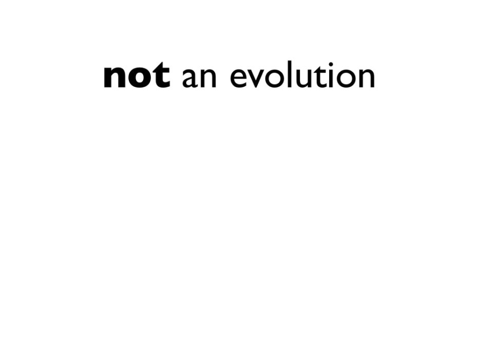
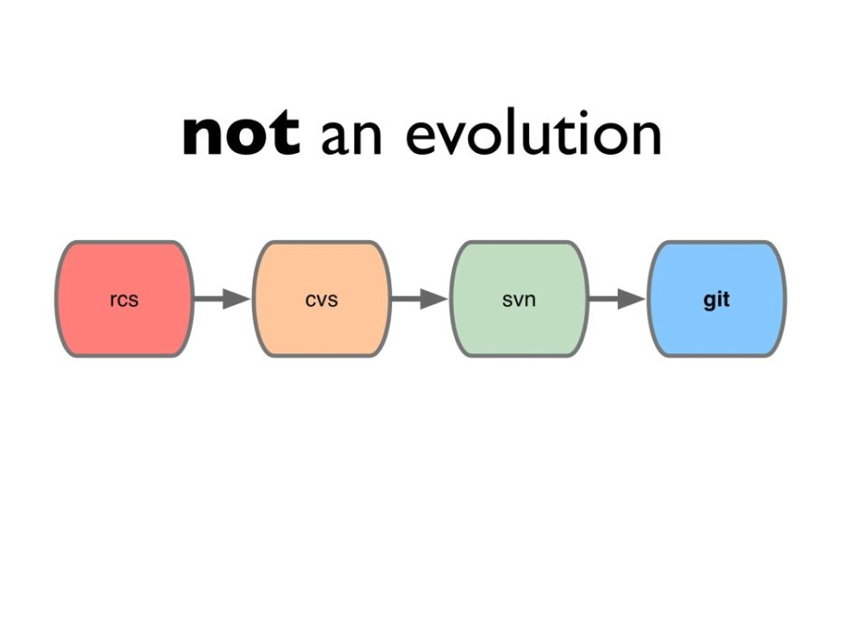
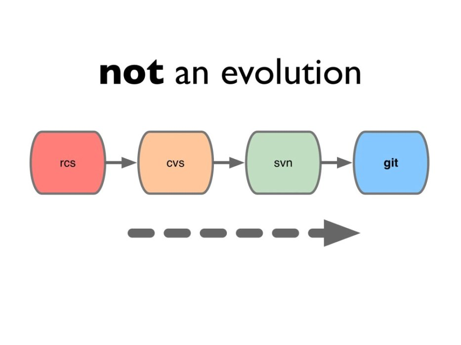
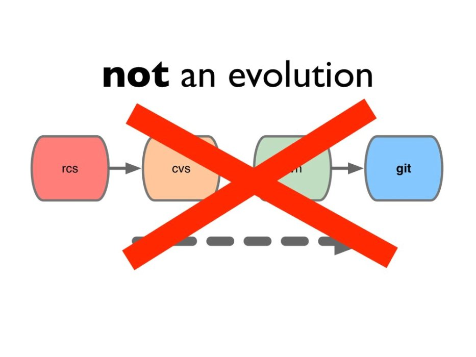

!SLIDE

# What is Git?

!SLIDE

Git is an open source, *distributed* version control
system designed for speed and efficiency

!SLIDE

# Which means...

* every clone is a backup
* everything is fast
* work offline

!SLIDE bullets incremental

# No Network Needed

* Performing a diff
* Viewing file history
* Committing changes
* Merging branches
* Obtaining any other revision of a file
* Switching branches

.notes Better performance isn't just the same thing but faster. It can affect
how you work, and the quality of your work.

!SLIDE commandline

# Cheap Branching, Easy Merging

    $ du -h testrepo
    78M testrepo/
    $ cd testrepo
    $ time git checkout -b newbranch
    Switch to a new branch "newbranch"

    real 0m0.091ms
    user 0m0.016s
    sys  0m0.023s

!SLIDE

# Git is...

not subversion!

!SLIDE

!SLIDE full-page

!SLIDE full-page

!SLIDE full-page

