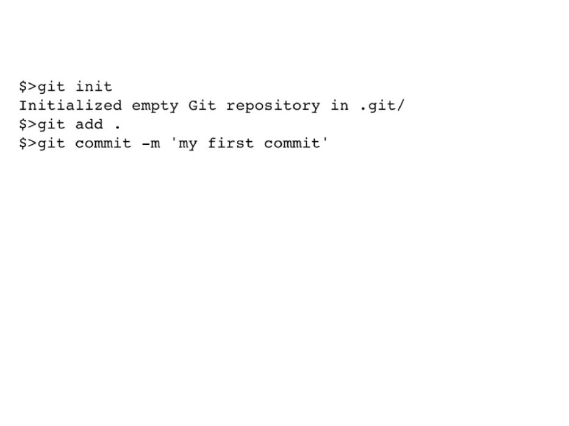
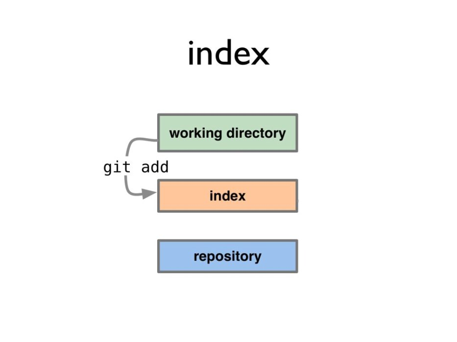
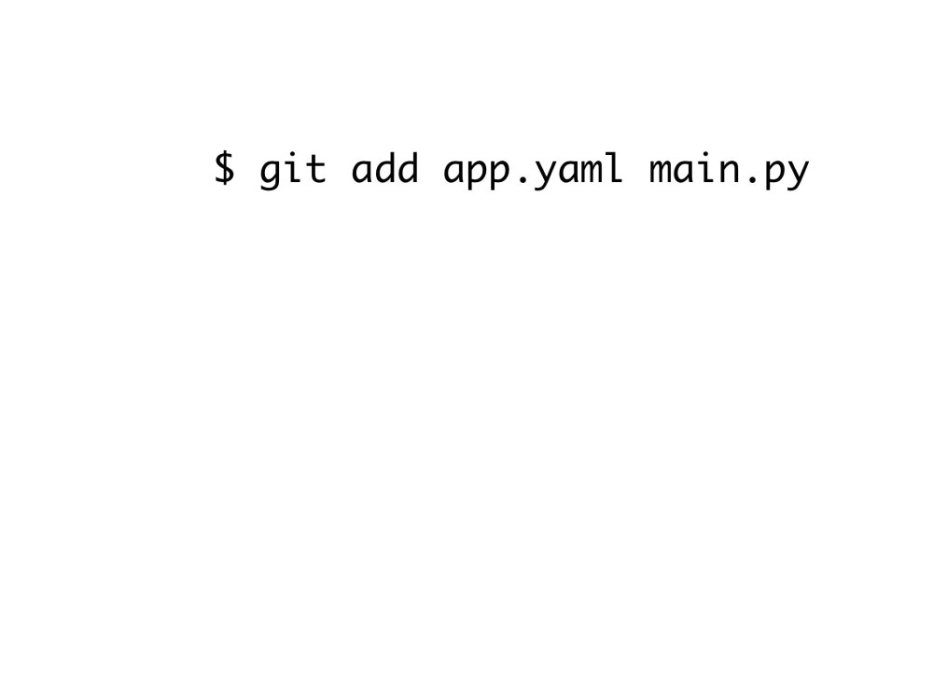

!SLIDE

# Getting a repo

!SLIDE commandline

# git clone

    $ git clone
    $ git clone https://github.com/rogerdudler/git-guide.git
    $ git clone git@github.com:openxc/openxc-android my-openxc

!SLIDE commandline

# Initializing a Repo

    $ mkdir myproject
    $ cd myproject
    $ touch README
    $ git init
    Initialized empty Git repository in /tmp/myproject/.git/

!SLIDE commandline

# The .git Directory

    $ tree -a
    .
    ├── .git
    │   ├── config
    │   ├── HEAD
    │   ├── hooks
    │   │   ├── ctags
    │   │   ├── post-checkout -> post-commit
    │   │   ├── post-commit
    │   │   ├── post-merge -> post-commit
    │   │   └── post-rewrite
    │   ├── objects
    │   │   ├── info
    │   │   └── pack
    │   └── refs
    │       ├── heads
    │       └── tags
    └── README

!SLIDE

# .gitignore

!SLIDE full-page

!SLIDE full-page

!SLIDE full-page

!SLIDE full-page

!SLIDE full-page

!SLIDE full-page

!SLIDE full-page

!SLIDE

# Normal Workflow

!SLIDE

# The Index

!SLIDE full-page

!SLIDE full-page

!SLIDE full-page

!SLIDE

# Adding and Committing

!SLIDE full-page

!SLIDE full-page

!SLIDE full-page

!SLIDE full-page

!SLIDE full-page

!SLIDE full-page

!SLIDE full-page

!SLIDE full-page

!SLIDE full-page

!SLIDE full-page

!SLIDE full-page

!SLIDE full-page

!SLIDE full-page

!SLIDE full-page

!SLIDE full-page

!SLIDE full-page

!SLIDE full-page

!SLIDE full-page

!SLIDE full-page

!SLIDE full-page

!SLIDE full-page

!SLIDE full-page

!SLIDE full-page

